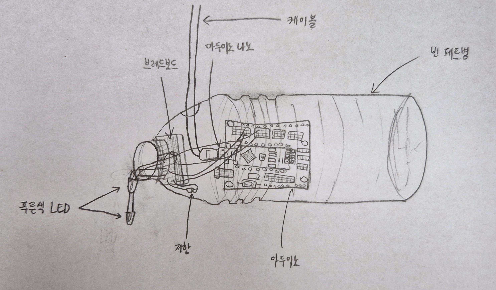
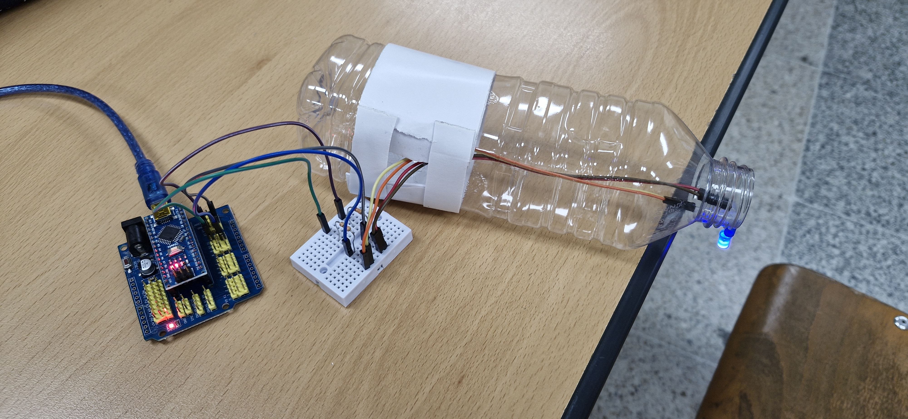

# 🌱 에코아트 프로젝트: 마지막 한 방울

## 📖 프로젝트 개요
- **제작자**: 20924임재이
- **제작일**: 2025-07-16
- **소개**
> 저는 이 작품을 통해 플라스틱과 같은 지나친 일회용 플라스틱 사용이 세계의 물을 부족하게 만든다는 사실을 직관적으로 전달하고 싶었습니다. 일회용 플라스틱을 사용한다고 해서 물이 부족해지지는 않을 것이라 생각할 수 있지만, 플라스틱을 생산하는 과정에서 막대한 양의 물이 사용되고 있고, 1kg의 PET 플라스틱을 생산하는 데 무려 23~30L의 물이 사용되어지고 있습니다. 이 물은 주로 냉각, 세척, 화학 반응 조절 등에 쓰이는데, 대부분은 오염된 상태로 배출되어 우리의 담수 자원을 오염시키고 있습니다. 많은 양의 물을 사용하는 것도 모자라 깨끗했던 담수 자원까지 오염시키고 있는 것입니다. 게다가 플라스틱이 만들어지고, 그 용도가 다하면 재활용될 수도 있지만, 많은 양의 플라스틱들은 그대로 자연에 버려지는 경우가 허다합니다. 이 경우에 플라스틱이 분해되며 발생하는 미세플라스틱에 의해 많은 해양생물들과 동식물들이 피해를 입기도 하며, 심지어는 죽음에 이르기까지 합니다. 또, 이러한 미세 플라스틱은 정수시설로도 걸러지기 어려워 담수 자원을 오염시키고, 심지어 미세 플라스틱을 먹은 생선을 그대로 먹어 몸 안에 미세 플라스틱이 축적되어 장기적으로 보았을 때 건강 상에 문제를 일으키는 경우가 발생할 수도 있습니다. 단순히 플라스틱 사용이 동식물에게만 피해를 입히는 것이 아니라 우리에게도 큰 해가 될 수 있고, 장기적으로 지구의 담수 자원을 고갈시키는 주요 원인이 될 수 있다는 것을 위 작품을 통해 전달하고 싶었습니다. 따라서, 이 작품으로 관객들이 일회용 플라스틱 사용에 대해 다시 한 번 생각해보게 만들고, 물 부족과의 연관성을 조금이라도 깨닫고서 플라스틱 사용을 줄이도록 하고 싶었습니다.

> 해당 작품은 페트병을 거꾸로 거치대에 매달고, 아래쪽 입구에서 물방울처럼 보이도록 LED를 설치하고, 아두이노로 느리게 깜빡이도록 코딩했습니다. 특히 LED 2개를 수직으로 연결하고, 2초 간격으로 번갈아서 켜지도록 설정함으로써 마치 마지막 한 방울이 떨어지는 듯한 시각적 효과를 주었습니다. 따라서 어두운 공간에서 LED가 깜빡일 때, 물방울이 서서히 떨어지는 모습을 연출했습니다.

## 📦 사용 재료
- 아두이노, LED, 브레드보드, 케이블, 노트북
- 투명 페트병, 그림 도안, 테이프, 가위, 글루건 등

## 🔧 제작 과정

### 1단계: 아이디어 스케치

- 아이디어 설명
> 페트병에 구멍을 뚫어 그 안으로 케이블 및 아두이노와 브레드보드를 집어넣고서 연결한 LED를 구멍 밖으로 꺼내 고정시킨 모양으로, 마치 물방울이 위에서 아래로 떨어지는 듯한 모습을 연출했습니다. 단순한 듯 하지만 그 속에는 심오한 의미를 담은 에코 아트 작품이라고 볼 수 있습니다.
- 예상 완성도
> 실제로 제작하는 과정에서 아두이노를 밖으로 꺼내고, 구멍의 위치를 바꾸는 등 많은 변동이 있었기 때문에 예상 완성도는 70% 정도인 것 같습니다. 하지만, 스케치 버전이나 실제 완성한 버전 모두 잘 구성되었고, 시각적으로도 어느정도 예쁘다고 생각합니다.
### 아두이노 코드
``` cpp
void setup() {
  pinMode(13, OUTPUT);
  pinMode(11,OUTPUT); 
}

void loop() {
  digitalWrite(13, HIGH);
  digitalWrite(11, LOW);
  delay(2000);

  digitalWrite(13, LOW);
  digitalWrite(11, HIGH);
  delay(2000);
}
```
### 2단계: 완성품


## 💭 제작 후기
### 잘된 점
- 생각외로 LED 고정이나 케이블의 배치가 순조로웠고, 페트병이 잘 안 잘릴 것이라고 생각했지만, 가위로도 쉽게 잘려서 제작은 예상보다 빨리 걸렸습니다. 물방울이 위에서 아래로 떨어지는 모습을 아두이노 코딩으로 연출하는 것이 어려울 것이라고 생각했지만, 간단한 코드만으로도 이러한 연출을 할 수 있어 좋았습니다.

### 아쉬운 점
- 페트병에 비해 아두이노의 크기가 크고 잘 보여서 작품의 모습이 복잡해보일 수 있다는 점이 조금은 아쉬웠습니다. 아두이노를 안에 넣고서 테이프로 가릴 수 있었지만, 투명하고 아무것도 없는 페트병의 모습을 원했기 때문에 아쉽지만 아두이노를 밖으로 꺼냈습니다.

### 개선할 점
- 아직은 아두이노 코딩이 미숙하고, 작품을 만들 때와 같이 발명품을 만들 때 아두이노의 배치를 어떻게 해야 더 실용적이고, 시각적으로 보기 편할 수 있는지를 조금 더 고민해봐야 할 것 같습니다.

### 내가 이미 알고 있었던 것
- '경기공유학교' 활동 프로그램의 일환으로 아두이노를 배웠던 적이 있었습니다. 이 경험을 통해 해당 활동에서 활용했던 Arduino IDE 프로그램과 아두이노 코딩 및 회로 연결 방법 등을 어느 정도 알고 있었습니다. 그래서, 어느 정도 익숙하게 활동에 참여할 수 있었던 것 같습니다.

### 새롭게 배운게 된 것
- 위 활동을 통해 LED를 번갈아 키는 코드와 같은 새로운 아두이노 코딩 개념을 배울 수 있었고, 세계의 다양한 에코 아트 작품들과 그러한 예술의 의미에 대해서 다시 한 번 생각해볼 수 있는 계기가 되었습니다.

### 더 알고 싶은 것
- 앞으로 더 많은 아두이노 코딩 개념과 문법을 익혀 더 많은 실용적이고 창의적인 발명품과 작품들을 만들어보고 싶습니다. 그리고 세계의 또 다른 에코 아트 작품은 무엇이 있는지도 알고 싶습니다.

## 🌍 환경적 의미
- 이 작품이 환경에 미치는 긍정적 영향
- 사용한 재활용 재료가 환경에 미치는 의미
- 앞으로의 환경 보호 다짐 등

## 📚 참고 자료
- [환경 관련 웹사이트](https://washedashore.org)
- [참고한 에코아트 작품](https://javierjaen.com/20-2-23-Barron-s-Rethinking-Plastic)

## 🏷️ 태그
#에코아트 #재활용 #환경보호 #DIY #창의활동

---

> 이 프로젝트는 환경 보호와 창의적 사고를 위한 교육 목적으로 제작되었습니다.
