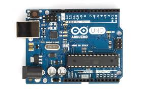

'''
void setup() {
  pinMode(13, OUTPUT);   // 빨간색 LED를 연결한 핀
  pinMode(11, OUTPUT);   // 초록색 LED를 연결한 핀
}

void loop() {
  digitalWrite(13, HIGH);  // 빨간 LED 켜기
  digitalWrite(11, LOW);   // 초록 LED 끄기
  delay(1000);            // 1초 기다리기

  digitalWrite(13, LOW);   // 빨간 LED 끄기
  digitalWrite(11, HIGH);  // 초록 LED 켜기
  delay(1000);            // 1초 기다리기
}
'''
# eco-art-project
# 가장 큰 제목
*정말* 멋져요
**핵심 기능**
## 두 번째 제목
- 순서 없는 목록
- 두 번째 항목
  - 하위 항목
1. 순서 있는 목록
2. 두 번째 항목
3. 세 번째 항목
### 세 번째 제목
